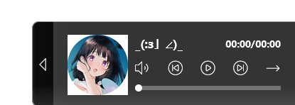
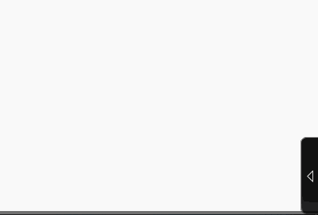

# vue-mini-player

This is a simple mini player which is based on [petite-vue](https://github.com/vuejs/petite-vue)

## Features

- 24kb size (CSS + JS without petite-vue).
- Base function with a simple audio list.
- Can move to page anywhere with mouse grab.
- Simply operate.

## Usage

Go to [release](./release) page to download it.

Use them in your html page:

```html
<!-- .css file path -->
<link rel="stylesheet" href="mini-player.css">

<!-- Petite Vue CDN -->
<script src="https://unpkg.com/petite-vue"></script>

<script type="module">
  // import js file at here!!
  import VueMiniPlayerCore from 'mini-player.esm.js'

  const { PlayerCore } = new VueMiniPlayerCore()

  PlayerCore.AppendSong({
    name: "Libertas",
    id: "1",
    src: "./Libertas.mp3"
  })
</script>
```

Then you can find it appear on your page right bottom corner.



If you don't want to use cdn file of js you can import the full ver which include full pvue:

```html
<!-- .css file path -->
<link rel="stylesheet" href="mini-player.css">

<script type="module">
  // import js file at here!!
  import VueMiniPlayerCore from 'mini-player.full.esm.js'

  const { PlayerCore } = new VueMiniPlayerCore()

  PlayerCore.AppendSong({
    name: "Libertas",
    id: "1",
    src: "./Libertas.mp3"
  })
</script>
```

File size will increase ~17kb.

## Mode explain

### Play Song Mode

There are 4 mode to auto change song after audio ended.

- Continue play until last song. (Default)
- Loop all song.
- Loop current song.
- Play Randomly.

### Move the player

Mouse move to the song title and grab it. Then you can begin to move it.



Please read [API](#API) part to learn how to operate it.

## API

Update irregularly.

If you want to get all api information, Please go to `src/core/MusicPlayerCore/index.ts` to get it.

#### SingleSongBriefInfo

Base info with a single song.

| key    | type                  | explaination                                |
| ------ | --------------------- | ------------------------------------------- |
| name   | string                | Song name, will appear on song name area.   |
| id     | number                | Song id, use Object to collect.             |
| src    | string                | Song audio source.                          |
| author | string[] \| undefined | Song author.                                |
| album  | string \| undefined   | Song album.                                 |
| img    | string \| undefined   | Song thumbnail, will appear at player left. |


## Operate the core

### Get the player core

```js
const { PlayerCore } = new VueMiniPlayerCore()
```

### Add a song

This is an example to add a song, it can also append at head!

```js
const { PlayerCore } = new VueMiniPlayerCore()

PlayerCore.AppendSongOnTail({
  name: 'Untitled World', 
  id: 2, 
  src: '',  // Your audio.
  img: ''   // Your thumbnail.
})
```

### Remove a song

In most of situation you can remove by song list button in the player. But also you can remove it by api:

```js
// remove by api
PlayerCore.RemoveSong(0)
```

## License

MIT
